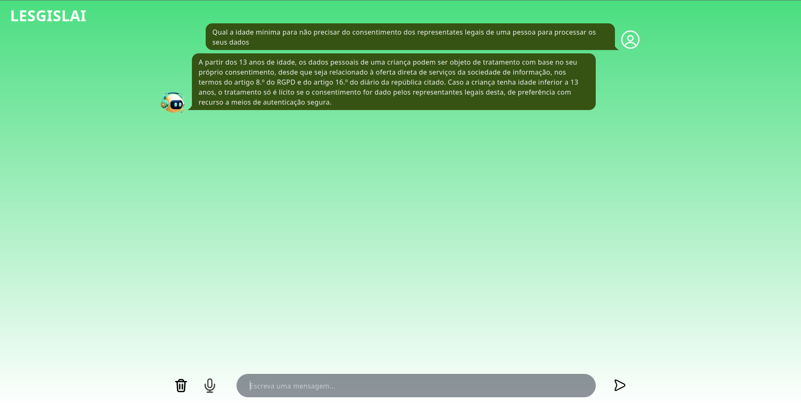

# LegislAI - Under Development

A aplicação por nós desenvolvida visa tornar acessível o consumo e informação de questões relacionadas com a legislação portuguesa tanto para o público geral como para profissionais da área que pretendam de forma rápida, sucinta e fidedigna obter informações quanto à mesma.

### Produto:

  
  

### O funcionamento da nossa aplicação é o seguinte:

### Stack Tecnológica:

Para auxílio à execução da nossa aplicação utilizamos o modelo Mistral 7B, de forma a não termos de treinar um modelo especificamente para este nosso contexto devido à sua complexidade e custo.

Sabemos ainda que estes modelos caressem de verificação da informação com a qual foram treinados, e que são passiveis de halucinar, o que não poderá acontecer numa solução com a importância da nossa, visto que informar de forma errada alguém poderá ter graves consequências.

Para mitigar os problemas enumerados acima optamos por uma arquitetura RAG (Retrieval Augmented Generation).

Como stack tecnológica, utilizamos, para a visualização/frontend NextJS e Tailwind, e para o backend Python.

Optamos por Python no backend visto ser das frameworks mais usadas para Ciência de Dados.

Para base de dados utilizamos Pinecone em cloud, visto o objetivo ser trabalhar com um grande conjunto de documentos legais.

### A arquitetura implementada é a seguinte:

Para a ingestão de documentos e divisão dos mesmos em chunks utilizamos a framework do llama-index.

Para gerar os embeddings de forma a serem guardados na base de dados de vetores, utilizamos o modelo do Hugging Face BAAI, e para base de dados vetorial selecionamos Pinecone.

Para a fase seguintem de retriever, damos embed à query do utilizador e procuramos pelas 5 entradas mais similares na base de dados.

De forma a termos mais contexto, vamos buscar também o valor da entrada acima e abaixo de cada uma para o caso de o chunking não ter "separado" o texto nos sítios corretos e mitigarmos a existência de entradas erradas.

Para a etapa final, de síntese e entrega ao utilizador, utilizamos um processo de prompt engineering onde passamos ao modelo Llama Index o contexto recolhido no passo anterior e a query do utilizador.

### No futuro:

Numa fase seguinte gostaríamos de integrar na equipa um elemento legal de forma a gerar um conjunto de perguntas e as respetivas respostas expectáveis de forma avaliarmos e validarmos a nossa solução. Gostariamos também, de possivelmente, gravar em metadados e fazer um parser mais cuidadoso nos artigos recentes.

Neste momento, o modelo apenas recebe alguns artigos da lei portuguesa, mas o grupo implementou um scraper, em python, que guarda todos os artigos, diretamente do site da Procuradoria-Geral Distrital de Lisboa (https://www.pgdlisboa.pt/leis/lei_main.php). No futuro, gostariamos de injetar esses dados no nosso modelo para mais fornecer mais informação.

No frontend, existe uma caixa 'Decretos do Dia' que redireciona para a página do Diário da República, no entanto, como objetivo futuro, pretende mos implementar um scraper para, diariamente, recolher os Decretos de Lei, guardar na base de dados e fornecer aos utilizadores consoante o dia que pretendem.

No entanto, na medida do possível, testamos a nossa solução, fazendo questões ao modelo que utilizamos na nossa arquitetura e ao LegislAI, onde obtivemos os seguintes resultados:

Questão: "Até que idade sou inimputável?"

{

"Resposta do LLM":" Inimputabilidade é um conceito jurídico que se refere à incapacidade de uma pessoa ser considerada responsável por seus atos por conta de determinadas condições mentais ou intelectuais. Não há uma idade específica em que uma pessoa se torna imputável ou não imputável, pois isso depende de uma avaliação individual da capacidade mental e intelectual da pessoa em questão.\n\nNo entanto, em muitos sistemas jurídicos, incluindo o brasileiro, a lei estabelece uma idade mínima para a responsabilidade criminal, abaixo da qual uma pessoa é considerada "menor de idade" e, portanto, não imputável. No Brasil, a idade mínima para a responsabilidade criminal é de 18 anos.\n\nEntão, respondendo à sua pergunta, você é inimputável até completar 18 anos de idade no Brasil. No entanto, é importante ressaltar que a inimputabilidade é um conceito diferente da menoridade e refere-se especificamente à capacidade de uma pessoa ser considerada responsável por seus atos perante o sistema jurídico.",

"Resposta do LegislAI":" De acordo com o artigo 19.º do diário da república citado, menores de 16 anos são inimputáveis. Portanto, até o seu 16º aniversário, você é considerado inimputável no Estado Português."

}

Questão: "Quais são as restrições à aplicação da lei portuguesa?"

{

"Resposta do LLM":" A aplicação da lei portuguesa está sujeita a diversas restrições, que visam garantir a legalidade, a proporcionalidade e o respeito pelos direitos fundamentais dos cidadãos. Algumas das principais restrições à aplicação da lei portuguesa são:\n\n1. Princípio da legalidade: A aplicação da lei deve ser baseada em leis claras, precisas e acessíveis, de forma a garantir que os cidadãos possam conhecer e prever as consequências de suas ações.\n2. Princípio da proporcionalidade: A aplicação da lei deve ser proporcional à gravidade da infração e às circunstâncias do caso concreto, de forma a evitar abusos ou excessos por parte das autoridades.\n3. Respeito pelos direitos fundamentais: A aplicação da lei deve respeitar os direitos fundamentais dos cidadãos, tais como o direito à vida, à liberdade, à intimidade, à liberdade de expressão e de religião, entre outros.\n4. Presunção de inocência: Todos os cidadãos são considerados inocentes até que se prove o contrário, o que significa que as autoridades devem provar a culpabilidade do réu além de toda a dúvida razoável.\n5. Não retroatividade da lei: A lei não pode ser aplicada retroativamente, o que significa que as leis não podem ser aplicadas a comportamentos ou situações que ocorreram antes de sua entrada em vigor.\n6. Separação de poderes: A aplicação da lei deve ser realizada de forma independente e imparcial, sem interferência de outros poderes do Estado, como o Poder Executivo ou o Poder Legislativo.\n7. Garantias processuais: Todos os cidadãos têm direito a um processo justo e equitativo, o que inclui o direito à defesa, à assistência jurídica, à comunicação com a família e à informação sobre os seus direitos e obrigações.\n8. Limites às prerrogativas de autoridade: As autoridades policiais e judiciárias têm limites às suas prerrogativas de autoridade, o que significa que não podem agir fora dos limites estabelecidos pela lei ou abusar do seu poder.\n9. Proteção aos grupos vulneráveis: A lei deve proteger os grupos vulneráveis, tais como crianças, idosos, deficientes e minorias étnicas, contra a discriminação e a violência.\n10. Respeito às normas internacionais: A aplicação da lei portuguesa deve respeitar as normas internacionais de direitos humanos, tais como os tratados e convenções internacionais assinados e ratificados por Portugal.",

"Resposta do LegislAI":" De acordo com o artigo 6.º do contexto fornecido, as restrições à aplicação da lei portuguesa a factos praticados fora do território nacional incluem:\n\n1. A lei portuguesa só se aplica a factos praticados fora do território nacional se o agente não tiver sido julgado no país da prática do facto ou se tiver subtraído ao cumprimento total ou parcial da condenação.\n2. Mesmo que a lei portuguesa seja aplicável, o facto será julgado de acordo com a lei do país em que foi praticado em casos específicos, tais como:\n\t* Quando o Estado Português o exigir;\n\t* Quando o agente é português ou reside habitualmente em Portugal;\n\t* Quando a vítima é um menor que reside habitualmente em Portugal;\n\t* Quando o agente é português ou estrangeiro que cometeu o crime contra um português, e encontra-se em Portugal;\n\t* Quando a legislação do local em que o facto foi praticado também o considera punível, exceto quando não haja poder punitivo nesse local;\n\t* Quando o crime admita extradição e esta não possa ser concedida ou seja decidida a não entrega do agente em execução de um mandado de detenção europeu ou de outro instrumento de cooperação internacional que vincule o Estado Português.\n\nAlém disso, de acordo com o artigo 4.º, a lei penal portuguesa é aplicável a leis praticadas em território português, independentemente da nacionalidade do agente, e a bordo de navios ou aeronaves portugueses. O artigo 5.º estende a aplicação da lei portuguesa a factos cometidos fora do território nacional em casos específicos, como crimes graves e crimes contra portugueses cometidos por portugueses que vivem habitualmente em Portugal."

}
